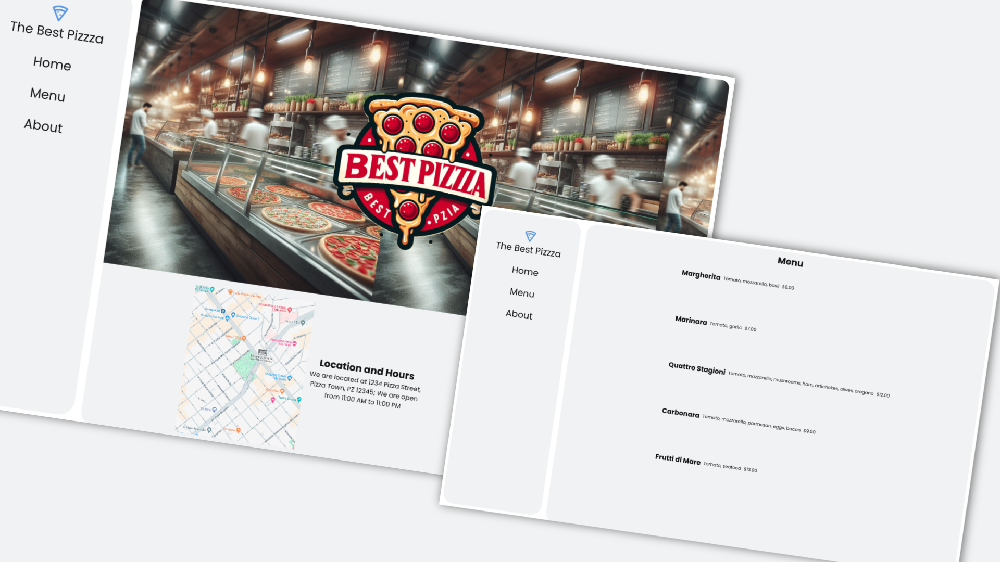

# Project Restaurant Page

## Description

This project is part of the odin project curriculum, the main goal is to create a restaurant page using only JavaScript to render the page. The main goal is to practice the use of modules and the use of webpack to bundle the files.

## Preview

    
   

## Live Demo

[Live Demo Link](https://mrescappe.github.io/PROJECT-Restaurant-page/)

## Made with

- 
- 

## What I learned

- How to use webpack to bundle the files.
- How to use modules to organize the code.
- How to use npm to install packages.

## Licensa de uso

- MIT. See [LICENSE](/LICENSE) for more details.
- Copyrigth (c) 2024 [José Sérgio](https://github.com/MrEscappe)
